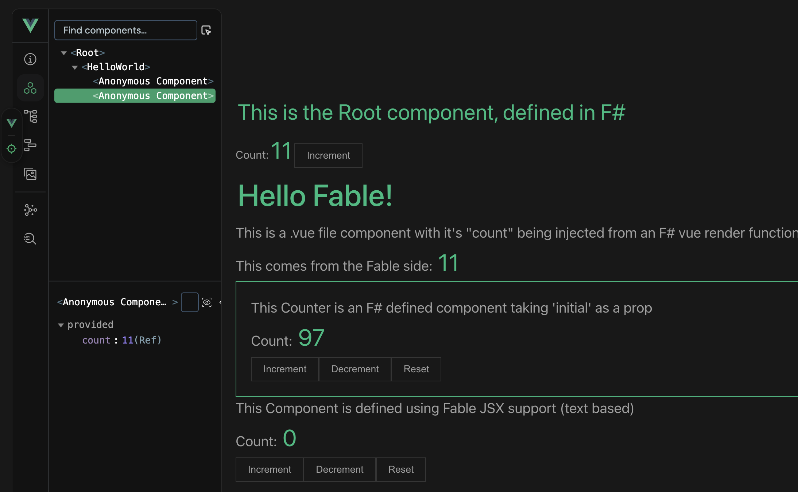

# Vue Bindings for Fable

This project offers a rudimentary set of bindings to enable you to build vue.js apps in F#
You can take a look at he `fsharp` directory and if you run the app, you should also see the `src/fsharp` output



## Project Setup

```sh
bun install
```

### Compile and Hot-Reload for Development

```sh
bun dev
```
